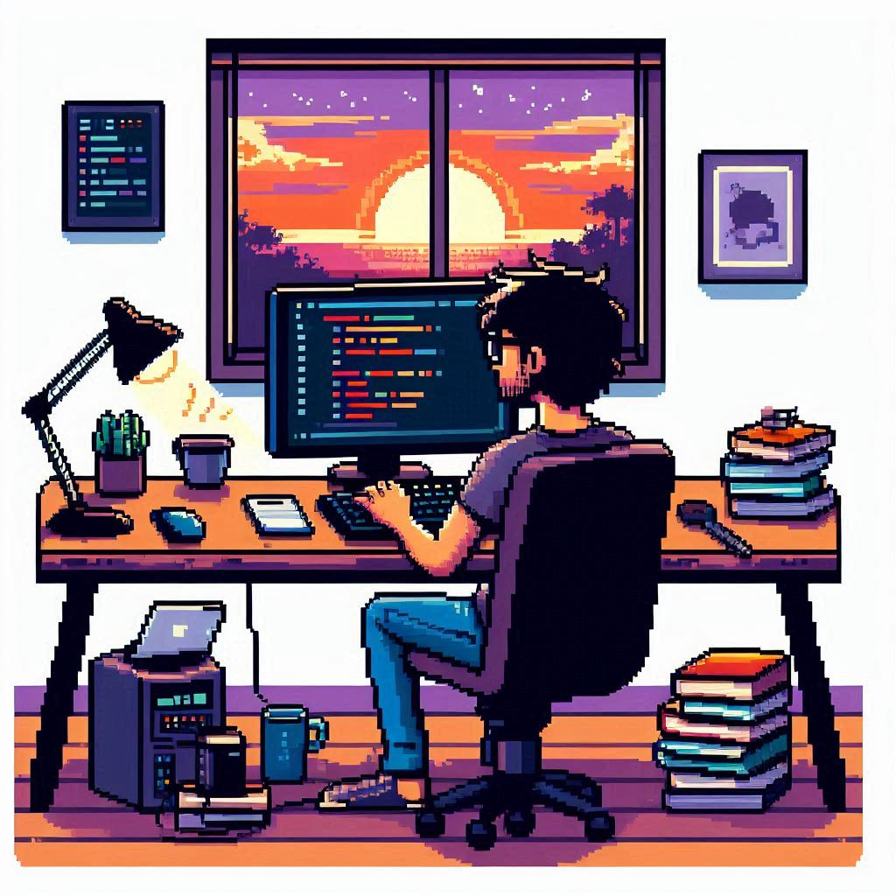

 

  

###

<h3 align="center">📋 Оглавление</h3>

- [👩‍💻 Обо мне](#-обо-мне) | [👩‍💻 About Me](#-about-me)
- [🚀 Проекты](#-проекты) | [🚀 Projects](#-projects)
- [🛠 Технологический стек](#-технологический-стек) | [🛠 Tech Stack](#-tech-stack)
- [📊 Статистика GitHub](#-статистика-github) | [📊 GitHub Statistics](#-github-statistics)

###

🇷🇺 Русская версия

###

<h1 align="center">Привет👋 Меня зовут Арсений!</h1>

###

  
  
  

###

  

###

<h3 align="left">👩‍💻 Обо мне</h3>

###

  Приветствую! Я <strong>Frontend-ориентированный Full-Stack разработчик</strong> с активным использованием современных веб-технологий. Мой путь в программировании начался во время получения высшего образования, где я изучал различные языки программирования и направления. Больше всего меня увлекла веб-разработка, особенно JavaScript экосистема и создание интерактивных пользовательских интерфейсов.

  🎯 <strong>Мои цели:</strong> Создавать качественные, масштабируемые веб-приложения с акцентом на отличный пользовательский опыт, используя современные frontend технологии и лучшие практики разработки.

  💼 <strong>Опыт работы:</strong> Разработка Telegram ботов на Python, веб-приложений на React, серверной части на Node.js/Express/NestJS, работа со стеком MERN (MongoDB, Express, React, Node.js), интеграция с различными API и базами данных.

  🔥 <strong>В активном поиске</strong> интересных проектов и возможностей для профессионального роста в области frontend и full-stack разработки!

###

  

###

<h3 align="left">🚀 Проекты</h3>

###

  
<strong>🤖 Telegram WebApp:</strong>

  <ul>
    <li><a href="https://t.me/ElitLegionBot" target="_blank">ElitLegionBot</a> - Многофункциональное WebApp для игрового сообщества</li>
    <li><a href="https://t.me/bankrotosvobodimbot" target="_blank">Bankrotosvobodimbot</a> - Специализированное WebApp для юридических услуг</li>
  </ul>

###

<h3 align="center">🛠 Технологический стек</h3>

###

<h4 align="left">🔧 Backend:</h4>

  
  
  
  
  
  
  
  
  
  
  
  
  

<h4 align="left">🎨 Frontend:</h4>

  
  
  
  
  
  
  
  
  
  
  
  
  
  
  
  
  

<h4 align="left">🗄️ Базы данных:</h4>

  
  
  
  
  

<h4 align="left">🛠️ Инструменты & DevOps:</h4>

  
  
  
  
  
  
  
  
  
  
  

###

<h3 align="left">📊 Статистика GitHub</h3>

###

  
  

---

🇺🇸 English Version

###

<h1 align="center">Hello👋 I'm Arseny!</h1>

###

  
  
  

###

  

###

<h3 align="left">👩‍💻 About Me</h3>

###

  Hello! I'm a <strong>Frontend-oriented Full-Stack developer</strong> with active usage of modern web technologies. My programming journey began during my higher education, where I explored various programming languages and domains. Web development captivated me the most, especially JavaScript ecosystem and creating interactive user interfaces.

  🎯 <strong>My Goals:</strong> Create high-quality, scalable web applications with focus on excellent user experience, using modern frontend technologies and development best practices.

  💼 <strong>Work Experience:</strong> Development of Telegram bots on Python, React web applications, backend development with Node.js/Express/NestJS, working with MERN stack (MongoDB, Express, React, Node.js), API integration and database management.

  🔥 <strong>Actively seeking</strong> interesting projects and opportunities for professional growth in frontend and full-stack development!

###

  

###

<h3 align="left">🚀 Projects</h3>

###

  
<strong>🤖 Telegram WebApp:</strong>

  <ul>
    <li><a href="https://t.me/ElitLegionBot" target="_blank">ElitLegionBot</a> - Multi-functional WebApp for gaming community</li>
    <li><a href="https://t.me/bankrotosvobodimbot" target="_blank">Bankrotosvobodimbot</a> - Specialized WebApp for legal services</li>
  </ul>

###

<h3 align="center">🛠 Tech Stack</h3>

###

<h4 align="left">🔧 Backend:</h4>

  
  
  
  
  
  
  
  
  
  
  
  
  

<h4 align="left">🎨 Frontend:</h4>

  
  
  
  
  
  
  
  
  
  
  
  
  
  
  
  
  

<h4 align="left">🗄️ Databases:</h4>

  
  
  
  
  

<h4 align="left">🛠️ Tools & DevOps:</h4>

  
  
  
  
  
  
  
  
  
  
  

###

<h3 align="left">📊 GitHub Statistics</h3>

###

  
  

